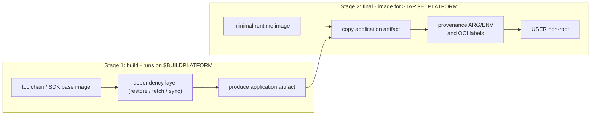
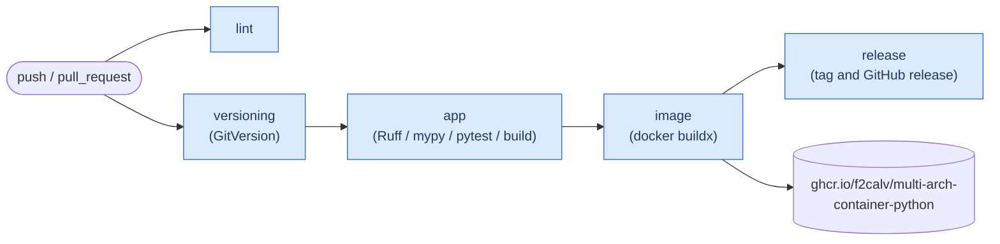

# Multi-Architecture Container Image w/Python

Build a Python application container image for `linux/amd64`, `linux/arm64`, and
`linux/arm/v7` from a single Dockerfile.

## Introduction

This repository demonstrates the single-Dockerfile approach used to run the same
worker application on local development machines, edge Kubernetes nodes, and cloud
container platforms with different processor architectures.

The application intentionally mirrors sibling implementations in C#/.NET, Go, and
Rust. Keeping their repository layouts, configuration keys, logs, workflows, and
Dockerfile comments aligned makes language and containerization choices easier to
compare.

## Sibling Repositories

| Repository | Language | Build image | Final image | Target mechanism |
| --- | --- | --- | --- | --- |
| [multi-arch-container-dotnet](https://github.com/f2calv/multi-arch-container-dotnet) | C# / .NET 10 | `mcr.microsoft.com/dotnet/sdk:10.0` | `mcr.microsoft.com/dotnet/runtime:10.0-noble-chiseled` | `dotnet publish -r <RID>` |
| [multi-arch-container-go](https://github.com/f2calv/multi-arch-container-go) | Go | `golang:1-bookworm` | `gcr.io/distroless/static-debian12:nonroot` | `GOOS` / `GOARCH` / `GOARM` |
| [multi-arch-container-rust](https://github.com/f2calv/multi-arch-container-rust) | Rust | `rust:1-bookworm` | `gcr.io/distroless/cc-debian12:nonroot` | `rustup target` and GNU cross linker |
| [multi-arch-container-python](https://github.com/f2calv/multi-arch-container-python) | Python 3.14 | `python:3.14-slim-bookworm` + uv | `python:3.14-slim-bookworm` | Architecture-neutral wheel and target-native runtime |

These repositories contain application code only. Kubernetes packaging lives in the
public [universal workload chart](https://github.com/f2calv/helm-charts/tree/main/charts/workload).

## Goals

* Construct a Python multi-architecture container image with one Dockerfile and
  `docker buildx`
* Demonstrate idiomatic structured logging and layered configuration with the same
  runtime contract in every language
* Keep Python, uv, lint, type-checking, and test dependencies inside a VS Code
  devcontainer
* Use shared GitHub Actions workflows for versioning, validation, image publishing,
  and releases

## Platform Mapping

`docker buildx` injects `TARGETARCH` and `TARGETVARIANT`. Python source and wheels
without native extensions are architecture-neutral, so the build stage runs once on
`$BUILDPLATFORM`; buildx then resolves the final Python image for each target.

The dependency layer installs the locked graph for a WebAssembly target with binary
packages required. This selects only universal `py3-none-any` wheels. The build then
rejects any native extension before copying `site-packages` into the three target
images.

| Docker platform | `TARGETARCH` | `TARGETVARIANT` | Python artifact | Runtime image |
| --- | --- | --- | --- | --- |
| `linux/amd64` | `amd64` | *(empty)* | `py3-none-any` wheel | amd64 CPython |
| `linux/arm64` | `arm64` | *(empty)* | `py3-none-any` wheel | arm64 CPython |
| `linux/arm/v7` | `arm` | `v7` | `py3-none-any` wheel | arm/v7 CPython |

The Dockerfile still validates the three target tokens explicitly. This makes an
unsupported platform fail clearly instead of producing an image outside the published
contract.

## Anatomy of the Dockerfile

All four sibling repositories use the same two-stage shape:



The five ideas worth carrying into other projects:

1. Pin the build stage to `$BUILDPLATFORM` so build tools run natively.
2. Resolve dependencies before copying frequently changed source files.
3. Validate `TARGETARCH` and `TARGETVARIANT` as one flat token: `amd64`, `arm64`,
   or `armv7`.
4. Use a BuildKit cache mount for uv's package cache.
5. Run the target-native final image as an unprivileged numeric user.

The distroless Python image does not publish an arm/v7 variant. The official
`python:3.14-slim-bookworm` image is therefore used for all three architectures. It is
larger and includes a shell, but it preserves the repository's complete platform
contract.

## Logging

Python's standard `logging` package provides process-wide logging. Custom formatters
emit either compact key-value text or newline-delimited JSON. Application modules
continue to use standard library loggers when OpenTelemetry is enabled.

| | .NET | Go | Rust | Python |
| --- | --- | --- | --- | --- |
| Library | Serilog behind `ILogger<T>` | `log/slog` | `tracing` | `logging` |
| Text/JSON switch | `app:log_format` | `app.log_format` | `app.log_format` | `app.log_format` |
| Verbosity | `Serilog:MinimumLevel` | `LOG_LEVEL` | `RUST_LOG` | `LOG_LEVEL` |

Set `APP__LOG_FORMAT=json` to emit JSON:

```bash
docker run --rm -e APP__LOG_FORMAT=json ghcr.io/f2calv/multi-arch-container-python
```

### OpenTelemetry

Set `OTEL_EXPORTER_OTLP_ENDPOINT` to enable batched logs, metrics and traces over
OTLP/HTTP with Protocol Buffers. Console logging remains enabled in the selected text
or JSON format. The worker emits a `worker.iteration` span and increments the
`worker.iterations` counter on every cycle.

```bash
docker run --rm \
  -e OTEL_EXPORTER_OTLP_ENDPOINT=http://otel-collector:4318 \
  -e OTEL_SERVICE_NAME=multi-arch-container-python \
  -e OTEL_RESOURCE_ATTRIBUTES=deployment.environment.name=development \
  ghcr.io/f2calv/multi-arch-container-python
```

The exporters honor signal-specific `OTEL_EXPORTER_OTLP_*` variables for endpoints,
headers, compression, certificates and timeouts. When the base endpoint is absent,
no OpenTelemetry provider or exporter is initialized.

## Configuration

Configuration is layered in ascending order of precedence:

1. Typed dataclass defaults
2. Optional [`appsettings.json`](appsettings.json)
3. Environment variables

The sibling .NET repository layers one extra source, an optional
`appsettings.${DOTNET_ENVIRONMENT}.json`, because `Host.CreateApplicationBuilder` provides
it for free. It is deliberately not reimplemented here - hand-rolling file resolution and
merge semantics to match a built-in is not a trade worth making in a reference repository.

Invalid types and out-of-range intervals fail startup with a configuration error.

| Key | Environment variable | Default | Description |
| --- | --- | --- | --- |
| `app.greeting` | `APP__GREETING` | `Hello from a multi-architecture container` | Message logged each iteration |
| `app.interval_seconds` | `APP__INTERVAL_SECONDS` | `3` | Delay between iterations, from 1 to 3600 seconds |
| `app.log_format` | `APP__LOG_FORMAT` | `text` | `text` or `json` |

Keys remain snake_case in both files and environment variables, matching the sibling
repositories exactly.

The Dockerfile also bakes build provenance into a flat set of environment variables:

| Environment variable | Description |
| --- | --- |
| `GIT_REPOSITORY` | Git repository name |
| `GIT_BRANCH` | Git branch name |
| `GIT_COMMIT` | Git commit SHA |
| `GIT_TAG` | Git tag |
| `GITHUB_WORKFLOW` | GitHub Actions workflow name |
| `GITHUB_RUN_ID` | GitHub Actions run ID |
| `GITHUB_RUN_NUMBER` | GitHub Actions run number |

## Run Pre-Built Container Image

```bash
# Run the published image
docker run --pull always --rm -it ghcr.io/f2calv/multi-arch-container-python

# Override worker configuration
docker run --pull always --rm -it \
  -e APP__GREETING="hello world" \
  -e APP__INTERVAL_SECONDS=1 \
  ghcr.io/f2calv/multi-arch-container-python

# Inspect the multi-architecture manifest
docker buildx imagetools inspect ghcr.io/f2calv/multi-arch-container-python
```

## Run on Kubernetes with Helm

The universal `workload` chart deploys this worker through the same framework-neutral
values used by the sibling repositories. Create `multi-arch-container-python.values.yaml`:

```yaml
kind: Deployment
replicaCount: 1

fullnameOverride: multi-arch-container-python

image:
  repository: ghcr.io/f2calv/multi-arch-container-python
  tag: 1.0.0
  pullPolicy: IfNotPresent

service:
  enabled: false

startupProbe: false
readinessProbe: false
livenessProbe: false

envVars:
  APP__GREETING: Hello from Python on Kubernetes
  APP__INTERVAL_SECONDS: "5"
  APP__LOG_FORMAT: json
  LOG_LEVEL: debug
```

Install or upgrade the deployment:

```bash
helm upgrade --install multi-arch-container-python oci://ghcr.io/f2calv/charts/workload \
  --version 1.0.2 \
  --values multi-arch-container-python.values.yaml

kubectl logs --follow deployment/multi-arch-container-python
helm uninstall multi-arch-container-python
```

## Self-Build Container Image Locally

Open the repository as a VS Code devcontainer so all Python and validation dependencies
remain isolated. From the repository root, run either build script:

```powershell
./build.ps1
```

```bash
./build.sh
```

Both scripts are byte-identical across the sibling repositories. Every value is derived
from Git rather than hard-coded.

A multi-platform image cannot be loaded into the local Docker image store. The scripts
therefore build `linux/amd64` with `--load` by default. Export an OCI archive to exercise every target:

```bash
PLATFORM=linux/amd64,linux/arm64,linux/arm/v7 OUTPUT=--output=type=oci,dest=multi-arch-container.tar ./build.sh
```

## Build and Test Commands

Run these commands inside the devcontainer:

```bash
# Restore exactly the locked development environment
uv sync --locked --all-groups

# Format, lint, and type-check
uv run --no-sync ruff format .
uv run --no-sync ruff check .
uv run --no-sync mypy

# Run tests
uv run --no-sync pytest

# Run the worker
uv run --no-sync multi-arch-container-python
```

## Run All Four Side by Side

The sibling .NET repository owns the cross-repository
[`docker-compose.yml`](https://github.com/f2calv/multi-arch-container-dotnet/blob/main/docker-compose.yml).
Clone all four repositories beside one another, then run `docker compose up --build`
from the .NET repository.

## Deployment Flow



## Docker, Container, and Python Resources

* [Docker multi-platform builds](https://docs.docker.com/build/building/multi-platform/)
* [Docker build cache optimization](https://docs.docker.com/build/cache/optimize/)
* [Official Python container image](https://hub.docker.com/_/python)
* [uv projects](https://docs.astral.sh/uv/concepts/projects/)
* [uv in Docker](https://docs.astral.sh/uv/guides/integration/docker/)
* [Python logging](https://docs.python.org/3/library/logging.html)
* [OpenTelemetry Python](https://opentelemetry.io/docs/languages/python/)

## Further Resources

* [C#/.NET sibling repository](https://github.com/f2calv/multi-arch-container-dotnet)
* [Go sibling repository](https://github.com/f2calv/multi-arch-container-go)
* [Rust sibling repository](https://github.com/f2calv/multi-arch-container-rust)
* [Universal Helm chart](https://github.com/f2calv/helm-charts)
